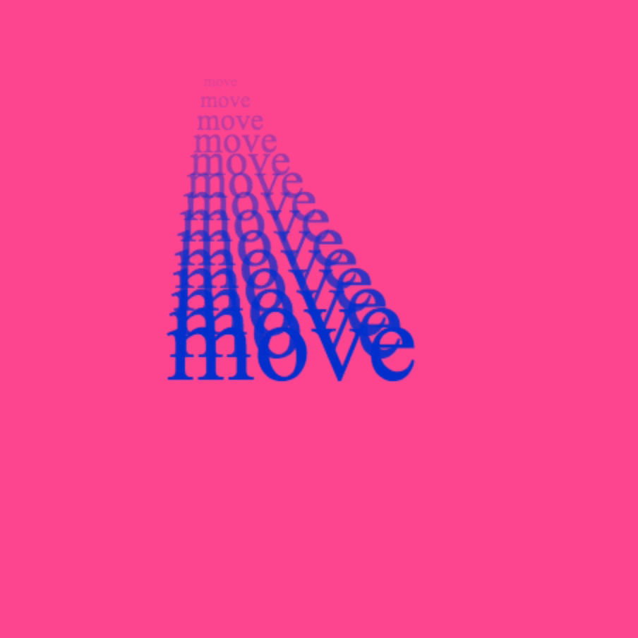
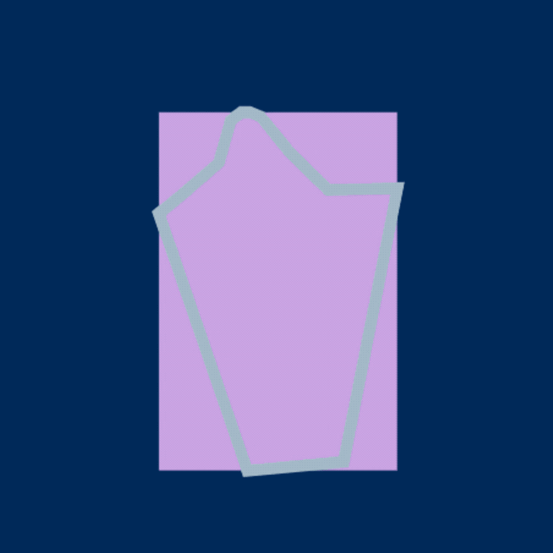

# PoseNet Sketchbook

##### A collection of web experiments designed to explore the use of PoseNet and tensorflow.js to create an artistic relationship between movement and machine. 


Check out the live demos [here](https://googlecreativelab.github.io/posenet-sketchbook/).

These prototypes are the thought starters that kicked off the process of creating [Body, Movement, Language: A.I. Sketches with Bill T. Jones](https://billtjonesai.com), a creative collaboration between The Google Creative Lab and New York Live Arts. Preparing for the first workshop with Bill and the Bill T. Jones/Arnie Zane Company, we wanted to provide examples of the range of interactions that PoseNet can enable, so we experimented with lots of different ways of using the model. This is essentially the raw starter sketchbook that asks: what can you do when you combine movement and machine? 

This is not a library or code repository that intends to evolve. Instead, it is an archive of Body, Movement, Language’s beginnings. You can use this collection of code as a starting point to create your own wacky or wild or just plain useful PoseNet experiments.

To read more about the journey from PoseNet Sketchbook to Body, Movement, Language in the blog post [here](https://medium.com/@mayaman/mixing-movement-and-machine-848095ea5596).

## Install and Run

First, clone or download this repository using the green button in the top right. For more information on how to do this, check out [this article](https://help.github.com/en/articles/cloning-a-repository). 

Next, Make sure you are in the project folder:
All of the commands below should be run from your terminal on your machine.

```sh
cd posenet-sketches
```

Install dependencies:

```sh
yarn
```

To watch files for changes, and launch a dev server:

```sh
yarn watch
```

The server should be running at **localhost:1234**.


### File structure
All sketches use PoseDetection.js, a wrapper class I created to handle the PoseNet data.

Each individual sketch is hosted in the 'sketches' folder.
- index.html: 
- style.css: Styling for the sketch.
- assets/: The thumbnail, gif, and any additional assets used in the sketch.
- js/: The soure files.
    - main.js: Set up the camera, load the video, and initialize Pose Detection and the sketch.
    - sketch.js: This is where the ~ magic ~ happens. Some functions to note:
        - setup: Initializes the the canvas width and height.
        - initSketchGui: Sets up the GUI elements that will affect the sketch and adds them to the GUI structure.
        - draw: Looping at 60 fps. Renders and updates elements on canvas with each call.

## The Sketches
### Basic
*How does PoseNet interpret your pose?*

[[ https://github.com/googlecreativelab/posenet-sketchbook/raw/master/sketches/basic/assets/moving.gif | height = 100px ]]


#### Movement Multiplier
*How might we allow past motion to linger?*


#### Text Trailer
*How might movement history affect text on screen?*



#### Shape Shifter
*How might movement be translated and abstracted into new forms?*


#### Collage Creator
*How might a variety of elements collage to recreate a figure on screen?*


#### Body Trnascriber
*How might spoken words manifest on screen in relation to the body?*


#### Color Mapper
*How might body poisition be used as a controller?*


#### Image Mapper
*How might body position surface and highlight content?*


#### Audio Controller
*How might body position manipulate an audio experience?*


## Contributors
Built by [Maya Man](https://github.com/mayaman) at the Google Creative Lab.

## Notes
This is not an official Google product.

We encourage open sourcing projects as a way of learning from each other. Please respect our and other creators’ rights, including copyright and trademark rights when present when sharing these works and creating derivative work. If you want more info on Google's policy, you can find it [here](https://www.google.com/permissions/). To contribute to the project, please refer to the [contributing](CONTRIBUTING.md) document in this repository.